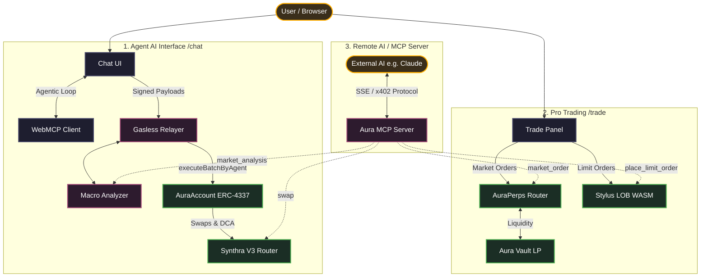

# Aura -- The AI Wealth Layer for Robinhood Chain

> **A Robinhood-grade trading experience powered by Multi-Agent AI, Account Abstraction, and a Stylus-native Order Book.**
> Built for the Arbitrum Open House London Buildathon 2026.

**Live Demo:** [https://aura-protocol-tawny.vercel.app](https://aura-protocol-tawny.vercel.app/)

---

## The Problem

DeFi onboarding is broken. Users face three barriers:
1. **Complexity**  manage seed phrases, choose protocols, calculate gas, sign approvals
2. **Gas friction**  every interaction requires the user to hold ETH
3. **Trust**  no safety net if a strategy is risky or a swap is bad

Aura solves all three by making DeFi feel like a fintech app -- but with full self-custody.

---

## The Solution

### Three pillars

#### 1. Agentic Intelligence -- Multi-Agent Committee
A **dual-agent safety architecture** that no other hackathon project has:

- **Executor Agent** translates natural language into precise on-chain plans (LangChain + NVIDIA Llama 3.1 70B)
- **Risk Auditor Agent** independently audits the proposal -- checks balances, allowances, slippage, macro context -- before signing
- **Macro Analyzer** integrates Pyth Network prices + correlation matrix + NewsAPI sentiment to add market context to every decision

Result: a user types *"DCA 0.001 ETH into AMZN every day for a week"*  both agents collaborate -- user gets a single signature prompt with full reasoning visible.

**New safety features:**
- **On-Chain Audit Trail** — before every gasless execution, the agent records a `keccak256` hash of its reasoning on-chain (`AuraAuditTrail` contract), creating verifiable proof of AI decision-making
- **AI Confidence Score** — the Risk Auditor computes a 0-100 confidence score for every trade, recorded on-chain via `recordReasoningWithScore`. Users see the score in the SignModal before signing — a first-of-its-kind on-chain AI confidence marker
- **Pyth Slippage Protection** — every swap calculates `minAmountOut` from real-time Pyth prices (1% max slippage by default)
- **Live Reasoning Stream** — the multi-agent committee's decision process is streamed to the frontend via SSE in real-time

#### 2. Stylus-Native Order Book + Guardrail
The first hackathon project to combine a **Rust/WASM perpetual order book** (Arbitrum Stylus) with a **Solidity Vault LP** (Robinhood Chain) for hybrid execution:

- **Limit orders** go to the Stylus LOB on Arbitrum Sepolia (compute-heavy matching, sorting)
- **Market orders** go to AuraPerps on Robinhood Chain (immediate liquidity vs Vault LP)
- **AI Keeper** bridges them: polls Pyth, calls `match_orders` on Stylus, settles fills via the Solidity router
- **Stylus Guardrail** (WASM) validates every trade on-chain: asset whitelist, max leverage, position size caps, daily volume limits — even if the AI is compromised

Benchmarked **34% gas savings** on `get_active_orders_sorted` (the hot path) vs pure Solidity at scale (see [bench results](#-stylus-vs-solidity-benchmark)).

#### 3. Retail UX -- Gasless & Intent-Based
- **Account Abstraction (EIP-4337)** via custom `AuraAccount` + `AuraPaymaster`
- **Natural language chat** for swaps and DCA
- **Live order book widget** updating every 5s on the trade page
- **One-click market orders** with Pyth-fresh entry prices

---

## Stylus vs Solidity -- Why WASM Matters

Real gas measurements from `scripts/bench-large-scale.js` on Arbitrum Sepolia with 60 resting orders:

| Operation | Stylus (WASM) | Solidity | Savings | Notes |
|---|---|---|---|---|
| `get_active_orders_sorted` cap=20 | **759 447** | 1 103 053 | **31%** | Sort-heavy, Stylus shines |
| `get_active_orders_sorted` cap=30 | **761 585** | 1 159 369 | **34%** | The hot path on every page render |
| `match_orders` (full scan) | 788 052 | 792 359 | ~0% | Break-even on simple iteration |
| `store_order` (cumulative 60) | 13 740 458 | 12 662 016 | +8% | Storage-bound, slight overhead |

We use Stylus exactly where it matters: the order book viewer called on every frontend render. Storage-only operations stay in Solidity where the runtime overhead is negligible.

Full benchmark details in the [dedicated section below](#stylus-vs-solidity-benchmark).

---

## Live Architecture



---

## Tech Stack

| Layer | Technology |
|---|---|
| **Smart Contracts (Solidity)** | OpenZeppelin, ERC-1967 Proxies, ERC-4626 (vault), EIP-4337 (account abstraction) |
| **Smart Contracts (Rust/WASM)** | Stylus SDK 0.10.6, alloy 1.5.7, Rust 1.91 |
| **AI Backend** | LangChain.js, NVIDIA NIM (Llama 3.1 70B), GPT-4o fallback, Pyth Hermes |
| **Frontend** | Next.js 15, React 19, viem, thirdweb v5 SDK, GSAP, Framer Motion |
| **Chains** | Robinhood Chain Testnet (perps + spot) + Arbitrum Sepolia (Stylus LOB) |

---

## Stylus vs Solidity Benchmark

Real numbers from `scripts/bench-large-scale.js` on Arbitrum Sepolia (60 resting orders):

| Operation | Stylus (WASM) | Solidity |  | Verdict |
|---|---|---|---|---|
| `store_order` (cumulative 60) | 13 740 458 | 12 662 016 | +8% | Storage-bound, slight overhead |
| `get_active_orders_sorted` cap=20 | **759 447** | 1 103 053 | **31%** |  Sort-heavy, Stylus shines |
| `get_active_orders_sorted` cap=30 | **761 585** | 1 159 369 | **34%** |  Same |
| `match_orders` (full scan, 0 hits) | 788 052 | 792 359 | ~0% | Break-even |
| `match_orders` (full scan, 16 hits) | 529 860 | 526 694 | ~0% | Break-even |

**Insight**: Stylus wins on compute-heavy hot paths (sort, scan large arrays). For storage-only operations the runtime overhead breaks even. We use Stylus exactly where it matters -- the order book viewer hit on every page render.

### Guardrail Benchmark (validate_trade)

Real numbers from `scripts/bench-guardrail.js` on Arbitrum Sepolia:

| Operation | Stylus (WASM) | Solidity | Overhead | Why |
|---|---|---|---|---|
| `validate_trade` (APPROVED) | 145 187 | 110 291 | +32% | Storage-bound (5 mapping reads + 2 writes) |
| `validate_trade` (REJECT leverage) | 98 527 | 63 886 | +54% | Early exit, minimal compute |
| `validate_trade` (REJECT asset) | 96 363 | 61 756 | +56% | Single mapping read |
| `get_stats` (view) | 67 118 | 30 679 | +119% | Pure storage read |
| Batch 10x `validate_trade` | 905 536 | 555 266 | +63% | Cumulative overhead |

**Why we still use Stylus for the Guardrail**: The guardrail is called once per trade (not per page render). The absolute cost difference is ~35K gas (~$0.001). We keep it in WASM for **architectural consistency** -- the same Rust codebase validates trades whether called from the LOB (Stylus-to-Stylus, zero cross-VM cost) or from the Solidity router. In production, the guardrail would be inlined into the LOB contract as a Stylus-to-Stylus internal call, eliminating the EVM→WASM bridge overhead entirely.

**Honest takeaway**: Stylus is not a silver bullet. It wins on compute (sort, scan, math) and loses on storage-only operations due to cross-VM overhead. We benchmark both and use each where it makes sense.

---

## Live Deployments

### Arbitrum Sepolia (Stylus LOB + Guardrail layer)
| Contract | Address |
|---|---|
| **Stylus LOB v2** | [`0x3346abe000118b25aca953f48deb1978a069e7de`](https://sepolia.arbiscan.io/address/0x3346abe000118b25aca953f48deb1978a069e7de) |
| **AuraCrossChainEscrow (Stylus)** | [`0x19147627a4b6b0b803b097d3c6216c3351d4913e`](https://sepolia.arbiscan.io/address/0x19147627a4b6b0b803b097d3c6216c3351d4913e) |

### Robinhood Chain Testnet (Settlement layer)
| Contract | Address |
|---|---|
| AuraPerps | `0x23aEa07e298d16b00d59c22c865065Be61edAa55` |
| AuraIntelligenceVault (ERC-4626) | `0x789b90ebAabC68858e9DEaAE8197793d582c66cb` |
| AuraPerpsRouter (Hybrid LOB) | `0x35650De9a304BB4eE9A0c23F2bcf0D9E71F7cDe3` |
| Synthra V3 Universal Router (Spot) | `0x6F308B834595312f734e65e273F2210f43Fc48F8` |
| AuraAccount Factory | `0x95Aa20d53EB26f292a71D8B38515BBeC8905b550` |
| AuraCopyTrading V2 | `0xd879DcfE7e62a1aD5877A006322A5EaF87E31ce8` |
| **Conditional Order Manager** | `0x981503939B94D0Aeb5110d96d2c4FDEE26b177C2` |
| **Liquidation Shield** | `0x8DB493DF1E09a15f02f90117b3d32cb5B2A6d4b2` |
| aUSD | `0x359961489f069F16E5dbA46d9b174bBF7b25147B` |
| Pyth MockOracle | `0x097AeB196366317cf97986A04f32Df312c96ABa1` |

---

## Social Trading — On-Chain Copy Trading

> **The first on-chain copy trading protocol on Robinhood Chain.** No other hackathon project has this.

Aura's Social Trading layer lets any user follow a top strategist and automatically copy their trades on-chain.

### How it works

| Role | Action | Reward |
|---|---|---|
| **Strategist** | Publishes a strategy with a name, description, and performance fee (max 20%) | Earns fees on profits above high-water mark |
| **Follower** | Deposits aUSD capital into a strategy | Capital grows when strategist wins |
| **Keeper** | Calls `executeForFollowers` to batch-copy trades | — |

### Key properties
- **No lock-up** — followers can `unfollow` and withdraw at any time
- **High-water mark** — performance fee only charged on new all-time highs (no double-dipping)
- **Gas-bounded** — max 100 followers per strategy, O(1) swap-and-pop removal
- **Guardrails** — max 50x leverage, max 20% fee, ReentrancyGuard on all state changes
- **339 tests total** (265 existing + 74 new social trading tests)

### Deployed Contract (Robinhood Chain Testnet)
| Contract | Address |
|---|---|
| AuraSocialTrading | `TBD — run deploy-social-trading.js` |

### Deploy
```bash
npx hardhat run scripts/deploy-social-trading.js --network robinhoodTestnet
```

### Frontend
Navigate to `/social` to see the live leaderboard of strategists with PnL, follower count, AUM, and a Follow button.

---

## Test Coverage

**265 passing tests** across security-critical paths:

```
Adversarial Security Tests (21 tests)
   Oracle Manipulation (zero price, front-running, extreme swings, stale oracle)
   Unauthorized Access (position theft, vault drain, router bypass)
   Reentrancy & Flash Loan Resistance (share inflation, double-close, double-liquidation)
   AuraAccount Access Control (agent impersonation, guardrail bypass)

Fuzz & Edge Case Tests (17 tests)
   Perps Invariants (position size formula, OI tracking, PnL direction)
   Vault Invariants (totalAssets >= totalSupply, deposit/withdraw roundtrip, share proportionality)
   Boundary Conditions (1 wei collateral, 50x leverage, partial close, multi-asset isolation)

AuraIntelligenceVault -- Full ERC-4626 vault security suite (25 tests)
   Deposit / Withdraw / Approve flows
   Risk Score Ceiling enforcement
   Function Selector whitelist
   Emergency Pause / Unpause
   Stylus Guardrail integration
   Protocol whitelist add/remove

AuraOrderBook -- Full lifecycle (24 tests)
   store_order (access control, params validation, counters)
   cancel_order (owner check, status flip, depth decrement)
   match_orders (bid/ask fill logic, cross-asset isolation)
   consume_order (atomic Active->Executed)
   get_active_orders_sorted (insertion sort, cap, empty)
   Stats tracking

Hybrid LOB+AMM Router (4 tests)
   Walks book first, falls back to Vault LP
   placeLimitOrderFor authorization for MMFund
   Rejects unauthorized callers

AuraAuditTrail -- On-Chain Reasoning Audit (42 tests)
   Deployment & permissionless recording
   Event emission with correct parameters (agent, user, hash, timestamp, action)
   Multiple records, duplicate hashes, batch stress test
   Gas efficiency (<50k per record)
   Event indexing (filterable by agent, user, or both)
   Integrity verification (hash matches off-chain reasoning)
   Security (cannot spoof msg.sender, timestamp is block.timestamp)
   AI Confidence Score (recordReasoningWithScore, dual event emission, score isolation per agent/user, boundary 0-100, legacy compat)

Aura Account Abstraction (6 tests)
   AuraAccount.executeBatch routing
   Factory deterministic deployments
   AI Agent guardrail enforcement

AuraPerpsRouter — Extended Coverage (22 tests)
   Cancel & Refund (collateral return, non-owner revert, double-cancel prevention)
   Multi-Maker Routing (walks multiple makers, skips oversized makers, fallback)
   Keeper matchAndExecute (crossed orders, access control, unregistered asset)
   View Functions (book depth, sorted arrays, asset hash, supported count)
   Parameter Validation (zero collateral, leverage >50, zero price, unregistered asset)
   Admin Controls (setKeeper, registerAsset ownership)

Stylus Guardrail — Fuzz & Edge Cases (17 tests)
   Whitelist Enforcement (non-whitelisted, bad selector, removal blocks calls)
   Leverage Bounds (0, 1, 50, 51 boundary + fuzz [1..50] + fuzz [51..200])
   Volume & Position Size (zero collateral, OI tracking long/short, multi-asset isolation)

AuraPerps — Edge Cases & Liquidation (17 tests)
   addMargin (increase collateral, closed position revert, non-owner revert)
   Trigger Orders TP/SL (set prices, SL execution, trigger-not-met revert, non-owner)
   Partial Close (size reduction, zero size revert, oversized revert, non-owner)
   Liquidation Edge Cases (bounty payout, safe position revert, double-liquidation, OI decrease)
```

Run with: `npx hardhat test`

---

## Hackathon Criteria

| Criterion | Aura's Edge |
|---|---|
| **Smart Contract Quality** | 265 tests (adversarial, fuzz, invariant, edge-case), OZ standards, ERC-4626 vault, EIP-4337 accounts, Stylus snake_case selector compatibility, gas-benched against Solidity |
| **Product-Market Fit** | Targets Robinhood Chain's massive retail audience. Gasless UX + chat = the same UX pattern as Robinhood, but with full self-custody and DeFi yields |
| **Innovation & Creativity** | First project to combine Multi-Agent safety + Stylus LOB + EIP-4337. Cross-chain hybrid (Stylus = compute, Robinhood = settlement) is novel |
| **Real Problem Solving** | Answers DeFi's three real barriers -- complexity, gas, trust -- without compromising self-custody |

---

## MCP Server — Any AI Can Trade

Aura exposes a **Model Context Protocol (MCP) server** so any AI agent (Claude Desktop, Cursor, Kiro, custom agents) can connect and trade perpetuals on the Stylus LOB + AuraPerps by simply adding a URL to their config.

**No other DeFi project has this.**

### Available Tools

| Tool | Description |
|---|---|
| `get_price` | Real-time Pyth price for BTC, ETH, TSLA, AMZN, NFLX, AMD, PLTR |
| `get_orderbook` | Live bids/asks from the Stylus WASM LOB (Arbitrum Sepolia) |
| `place_limit_order` | Place a limit order on the Stylus LOB — matched by AI Keeper |
| `place_market_order` | Open a perp position at market price (Robinhood Chain) + records audit trail on-chain |
| `get_positions` | Read open positions with live PnL |
| `close_position` | Close a position by ID |
| `get_account_balance` | Get aUSD and ETH balance for your AuraAccount |
| `set_stop_loss_take_profit` | Set TP/SL trigger prices on an open position |
| `add_margin` | Add collateral to reduce liquidation risk |
| `get_market_analysis` | AI macro analysis: Pyth prices + Fear & Greed sentiment + cross-asset correlations |
| `get_funding_rate` | Funding rate, open interest, and long/short skew per asset |
| `partial_close` | Partially close a position (take profit on a portion) |
| `dca_order` | Schedule a Dollar-Cost-Average strategy (auto-open positions at intervals) |
| `cancel_dca` | Cancel an active DCA strategy |
| `get_audit_trail` | Read on-chain AI audit trail: reasoning hashes, confidence scores, agent reputation |
| `get_pnl_summary` | Portfolio analytics: total PnL, win rate, best/worst trade, volume |
| `get_liquidation_price` | Calculate exact liquidation price for any open position |
| `get_supported_assets` | List all tradeable assets with live prices |
| `cancel_limit_order` | Cancel an active limit order on the Stylus LOB |
| `swap` | Swap tokens via Synthra V3 Router (Robinhood Chain) |
| `deposit_vault` | Deposit aUSD into the ERC-4626 Perp Vault to earn yield |
| `authenticate` | (HTTP mode) Authenticate with your Aura API key for per-user trading |

### Claude Desktop Config

```json
{
  "mcpServers": {
    "aura-perps": {
      "command": "node",
      "args": ["backend/mcpServer.mjs"],
      "cwd": "/path/to/arbitrum_hackathon"
    }
  }
}
```

### HTTP Mode (Remote Agents)

```bash
cd backend && node mcpServer.mjs --http 3002
# → MCP endpoint: http://localhost:3002/mcp
```

Any MCP-compatible client can then connect to `http://your-server:3002/mcp` and trade.

### Example Interaction

```
User → Claude: "Long BTC 10x with $100 collateral at limit price $95000"
Claude → [calls place_limit_order tool via MCP]
Claude → "Done! Limit order placed on Stylus LOB. TX: 0xabc..."
```

---

## x402 Protocol Integration (Monetization for AI Agents)

Aura Protocol has fully integrated the **x402 protocol** (HTTP 402 Payment Required) to monetize its MCP Server and API endpoints. 

Since Aura exposes a Model Context Protocol (MCP) server for remote AI agents (like Claude Desktop or custom trading bots), these agents consume computational resources and premium data (e.g., Pyth Network feeds, NewsAPI sentiment analysis).

The Express backend and MCP server are protected by an x402 middleware:
1. Remote AI agents receive an HTTP 402 response when requesting premium analyses (`get_market_analysis`) or executing complex on-chain strategies.
2. The agent settles a micro-payment (e.g., 0.50 USDC) natively on Arbitrum.
3. Upon verifying the payment receipt, the Aura backend serves the data/execution.

This makes Aura a true "Machine-to-Machine" (M2M) economy, where autonomous agents pay for services programmatically without human intervention.

---

## Setup & Quickstart

### Prerequisites

- Node.js >= 18
- MetaMask (or any EVM wallet)
- ETH on Arbitrum Sepolia (for limit orders)
- ETH on Robinhood Chain Testnet (for market orders)

### 1. Clone & Install

```bash
git clone https://github.com/maxence81/Aura-Protocol.git
cd Aura-Protocol
npm install
cd backend && npm install && cd ..
cd frontend && npm install && cd ..
```

### 2. Configure Environment

```bash
# Root (for Hardhat scripts & tests)
cp .env.example .env
# Edit .env and add your PRIVATE_KEY + API keys

# Backend
cp backend/.env.example backend/.env
# Edit backend/.env with the same values
```

Required keys:
- `PRIVATE_KEY` -- deployer wallet (must have ETH on both chains)
- `NVIDIA_API_KEY` -- get one free at https://build.nvidia.com (Llama 3.1 70B)
- `NEWSAPI` -- free at https://newsapi.org

All contract addresses are pre-filled with our live testnet deployments.

### 3. Compile & Test

```bash
npx hardhat compile
npx hardhat test                    # 265 tests, all passing
```

### 4. Run the Stylus vs Solidity Benchmark

```bash
npx hardhat run scripts/bench-large-scale.js --network arbitrumSepolia
```

### 5. Run the Full Demo (4 terminals)

```bash
# Terminal 1 -- Backend API (port 3001)
cd backend && node index.js

# Terminal 2 -- AI Market Maker (populates the Stylus LOB with quotes)
cd backend && node marketMaker.js

# Terminal 3 -- AI Keeper (matches orders + cross-chain settlement)
cd backend && node lobKeeper.js

# Terminal 4 -- Frontend (port 3000)
cd frontend && npm run dev
```

### 6. Use the App

1. Open http://localhost:3000
2. Connect MetaMask
3. `/chat` -- type "Swap 0.001 ETH to AMZN" to see the Multi-Agent Committee in action
4. `/trade` -- place market or limit orders on the live Stylus Order Book
5. `/vault` -- deposit aUSD into the AI-managed ERC-4626 vault

The AI Market Maker will populate the order book within 30 seconds. The Keeper matches orders every 10 seconds and settles positions cross-chain on Robinhood Chain.

---

## Repository Structure

```
arbitrum_hackathon/
 contracts/              Solidity contracts (perps, vault, account, paymaster, audit trail)
 stylus-orderbook/       Rust/WASM order book (Stylus 0.10.6)
 stylus-guardrail/       Rust/WASM trade validator (Stylus 0.10.6)
 backend/                Node.js multi-agent backend
    agent.js            Executor + Risk Auditor + Slippage Protection
    macroAnalyzer.js    Pyth + news + correlations
    marketMaker.js      AI Market Maker (Stylus LOB)
    lobKeeper.js        AI Keeper (Pyth -- match_orders)
    index.js            Express API + SSE streaming
 frontend/               Next.js 15 trading UI
    app/trade/          Perpetual trading page (LOB + market orders)
    app/chat/           Multi-agent chat for swaps & DCA
    app/vault/          ERC-4626 deposit / withdraw
 scripts/                Hardhat deploy + bench scripts
 test/                   Hardhat test suite (265 tests)
 ARCHITECTURE.md         Full architecture reference
```

---

## Demo

> *"Aura: where AI meets safe, retail-first DeFi on Arbitrum + Robinhood Chain."*

A typical user flow:
1. Connect wallet
2. Type *"Swap 0.001 ETH for AMZN"*  Multi-Agent Committee analyzes -- SignModal appears
3. Sign with one click
4. Or go to `/trade`  see the **Live Stylus Order Book** populated by the AI Market Maker -- place a limit order -- watch the keeper match it in real time

---

## License

MIT
